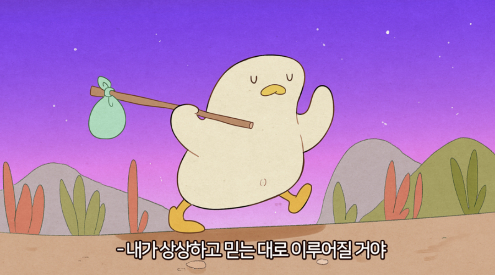

### 🙄 블로그를 시작한 이유

해당 글과 함께 블로그를 시작하려고 한다!

  

  블로그 작성중...

--- 
### 내가 블로그를 시작한 이유는 크게 세 가지가 있다.

### 1️⃣ 첫번째, 애매했던 내용을 명확히

내가 공부한 내용이 명확하지 않고 애매하게 알고 있다는 생각을 느끼게 되었다.  
어떤 목적을 위해 사용됐는지, 보다 개선할 수 있는 방향은 없는가에 대한 고민을 하지 않았던 과거의 나를 반성하며 애매하던 내용을 다시금 정리하고 블로그에 기록하며 보다 명확히 익히는 계기를 만들고, 이후 머릿속에서 휘발되었을 때 나의 생각으로 정리한 내용으로 복습하고자 하는 것이 첫번째 목적이다.
 

### 2️⃣ 두번째, 동기부여

나름 꾸준히 공부했지만, 막상 내가 공부한 기록이 없으니 그동안 내가 무엇을 공부했고, 어떤 고민을 했으며, 어떤 성취를 이루었는지 기억할 수 없다는 점이다.
  블로그에 글을 작성하여 뒤돌아 봤을 때, 내가 헛된 시간을 보내지 않았음을 느낄 수 있도록, 내가 무엇을 공부하였고 무엇을 이루고자 했는가를 기록하며 나 자신의 성장을 확인하고 동기부여가 되도록 하는 것이 두번째 목적이다.

### 3️⃣ 세번째, 프로젝트의 기록

다양한 프로젝트를 진행해보며 겪은 문제와 이를 해결하는 과정, 느낀점 등을 기록하고자 한다. 
프로젝트를 진행하며 겪은 많은 고민과 우여곡절을 그저 추억으로 남기지 않고 나의 성장의 일부분으로 삼을 수 있도록 고민과 해결의 과정을 기록하는 것이 세번째 목적이다.

---
 

  

 
이러니 저러니 이야기 했지만, 결국 기록의 중요성을 느꼈기 때문에 블로그를 시작하고자 한다!

 
꾸준히 블로그를 작성하며 내가 성장할 수 있기를 바라며 첫 블로그 게시물을 마치고자 한다 😎

---

